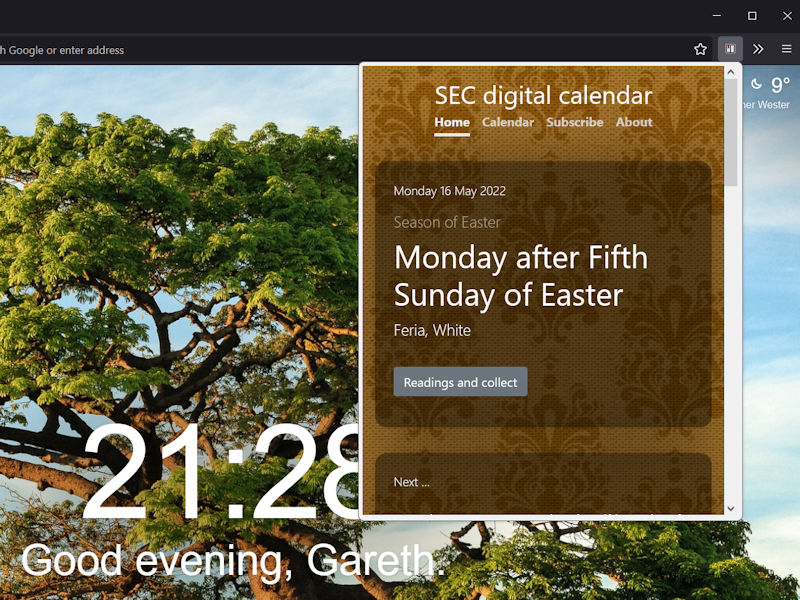
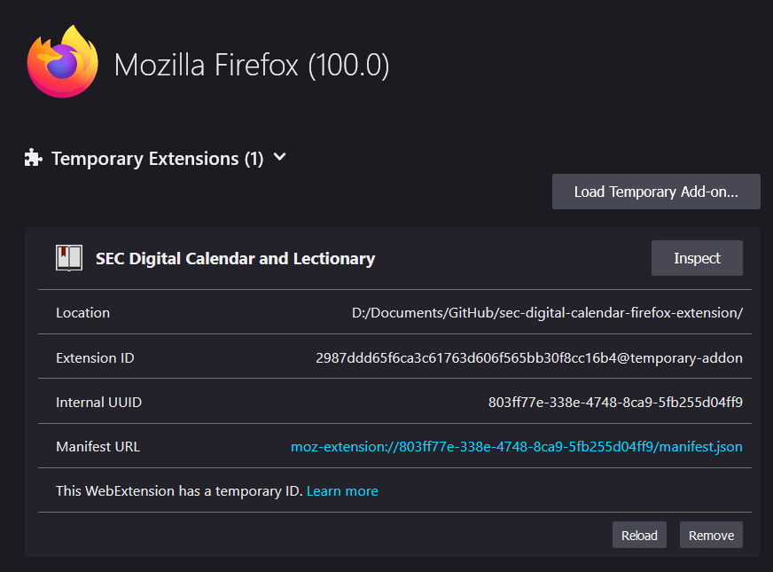

# SEC Digital Calendar Mozilla Firefox extension

View the [Scottish Episcopal Church digital calendar and lectionary](https://www.seccalendar.org.uk/) in a popup window on your web browser's toolbar.

Save time with this handy browser extension to quickly view today's feast in a popup window on your browser's toolbar.

The button opens the full website in mobile-view in a small window, so you can access everything on this site within the toolbar popup.

Want to move everything to a full tab? Right-click a link and select 'Open link in new tab'.

## Pending Review at addons.mozilla.org

**This extension has been submitted to addons.mozilla.org and is pending review. In the meantime, feel free to download it and sideload it into Firefox.**

1. Download the files from this repo and unzip them to a folder on your computer.
2. In Firefox go to settings (...) > Add-ons and themes (Ctrl + Shift + A).
3. Click the cog icon and select Debug Add-ons.
4. Make sure "This Firefox" is selected in the left-hand navigation.
5. Click "Load Temporary Add-on..." button.
6. Locate the folder you unzipped and select the "manifest.json" file.
7. Click Open.
8. The extension will load in Firefox.

